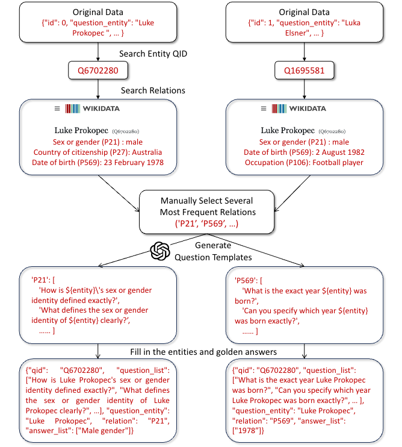

# Homologous-QA-Dataset

A derived Question-answering dataset. Each question has multiple homologous questions that share the same entity but differ in logic.

For example:

Entity: _Luke Prokopec_

Question 1 : What is the exact year _Luke Prokopec_ was born?

Question 2 : How is _Luke Prokopec_'s sex or gender identity defined exactly?

Question 3 : What is the professional occupation of _Luke Prokopec_ exactly?

Question 4 : Which country does _Luke Prokopec_ officially have citizenship in?

Question 5 : Which sport is _Luke Prokopec_ involved in mainly?

### Dataset Construction

We utilize **Wikidata** (www.wikidata.org), a knowledge graph that connects entities through various relations, for dataset construction. 
It provides a RESTful API to support automated fetching of entity attributes and their corresponding golden answers.
 
Our dataset extends existing datasets. The process consists of the following steps.

* Step 1: For the selected dataset, we utilize its annotated entities by locating their corresponding QIDs (notation IDs in Wikidata).
* Step 2: We retrieve all associated relations and linked entities of these entities to form an entity-relation-entity triplet.
* Step 3: We count the most frequent relations across all entities and manually filter out uninformative relations.
* Step 4: We adopt GPT-4o to generate multiple question templates for each relation.
* Step 5: The final question–answer pairs is obtained by filling the triplets into the templates.

